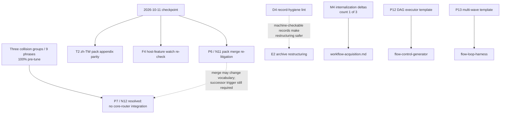

# Dormant-Work Specs — TeaPrompt (2026-07-11)

> **Status: pre-drafted specs for dormant items (non-authoritative; NOT adoption).**
> This document writes down, ahead of time, what each deferred / trigger-gated /
> rejected-with-precondition item in the
> [whole-project roadmap](whole-project-roadmap-2026-07-11.md) would look like if
> its trigger fired: rationale, draft spec, draft acceptance criteria, and a test
> plan. Writing a spec here changes no gate and adopts nothing — queue discipline
> from the roadmap holds: **a fired trigger authorizes re-litigation, not silent
> adoption**, and every decision stays with the owning record cited per item.
> If this file and an owning record disagree, the record wins.
>
> Companion artifacts: [checkpoint runbook](checkpoint-2026-10-11-runbook.md)
> (operator procedure for the only date-gated checkpoint) and the deterministic
> guards in `plans/tests/test_dormant_item_watch.py`,
> `plans/tests/test_dormant_conditional_contracts.py`,
> `plans/tests/test_checkpoint_2026_10_11.py`, and
> `plans/tests/test_dormant_work_specs_doc.py`.

## Why

- The [whole-project plan](whole-project-plan-2026-07-11.md) names **trigger
  drift** — deferred items whose triggers fire unnoticed — as the highest
  planning risk, mitigated today only by checkpoint review and per-record
  falsifiability prose. Prose does not fail CI; tests do.
- Re-litigation is expensive when it starts from a blank page. Each panel record
  owns a decision but not an implementation-ready spec; when a trigger fires,
  the review must reconstruct acceptance criteria from scattered records. A
  pre-drafted spec makes the future panel's job verification, not archaeology.
- Both mitigations can be built now without touching any gate: specs live in the
  non-authoritative `plans/` layer, and the new tests guard only **ledger
  presence and trigger state**, exactly the scope the
  [Adoption Guard Closure](../GLOSSARY.md#adoption-guard-closure) rule permits
  for deferred and rejected rows.

## Scope

- In scope: one spec section per dormant item in the roadmap's Horizon 2/3
  queues, preconditions for the two named rejected items, draft content for the
  two pure-documentation items (M6, T2), and documentation of the new
  deterministic guards.
- Out of scope: adopting anything; editing core skills, packs, router, route
  fixtures, `Makefile`, or any governed surface; changing any trigger's wording;
  re-arguing any rejected item. Nothing here overrides
  [Standing Non-Goals](../PROJECT_KNOWLEDGE.md#standing-non-goals).

## Adoption update (2026-07-12)

After repeated explicit user instruction, the feasible non-destructive dormant
items were adopted as **user-directed exceptions** with recurrence recorded
`unknown`: T2, M4, M6, M7, D4, P12, P13, and the writer-critic deterministic
companion. The per-item sections below remain useful as the pre-adoption design
trail; the successor source of truth for the adoption wave is
[dormant-items-user-directed-adoption-2026-07-12.md](dormant-items-user-directed-adoption-2026-07-12.md).

P6 remains date/usage-gated. E2 remains destructive and recurrence-gated.

## How the register hangs together (inference)

Reasoning over the queue, labeled per the evidence policy — everything in this
section is `[INFERENCE]` from the records read this session, not new evidence:

- **One upstream item resolved.** P7's collision evidence now exists: three
  groups / 9 phrases preserved plan, route-selection, and executable-script
  intent at 100% pre-tune, so P7 closed as no core-router integration. T2 keeps
  its independent EN-stability gate. D4 (record-hygiene lint) remains upstream
  of archive hygiene: if it fires, E2-style restructuring becomes safer because
  records carry machine-checkable structure.
- **Most likely to fire first.** M4 sits at count 1 of 3 with a cheap trigger
  (any ephemeral-source internalization session); P12's trigger is deliberately
  cheap by design ("first such local task", the pack panel's own words for why
  the pro-add dissent re-fires on demand). The checkpoint itself (P6/T2) is the
  only *certain* future event — 2026-10-11.
- **Least likely to fire.** E2 needs a *second independent* archive-weight
  complaint; M7 needs TeaPrompt-local sensitive evidence, which the managed-skill
  record itself judged implausible today ("TeaPrompt evidence is not sensitive
  operational data today"). S3 packaging needs an external demand signal that no
  telemetry can observe passively — someone has to say it out loud.
- **P6 interaction to watch.** If the 2026-10-11 checkpoint merges or demotes a
  pack, the P7 collision vocabulary and host-invocation assumption may change.
  That does not automatically reverse P7; it fires a successor review only when
  the decision record's misroute/discoverability or host-capability trigger is
  also met. The runbook still orders P6 before routing-surface discussion.
- **Self-referential risk.** This spec book is itself archive weight — the very
  thing E2 complains about. Mitigations: one consolidated file instead of
  fifteen; a parity test that fails if the roadmap's queue and this book drift
  apart; and an explicit retirement trigger (see Falsifiability).



## Spec template

Every item section carries the same fields:

- **Status** — dormant class from the roadmap (date-gated / trigger-gated /
  event-gated / rejected-with-precondition).
- **Owning record** — the file that owns the decision.
- **Trigger (verbatim)** — quoted from the owning surface; if the quote here and
  the record ever differ, the record wins and this file is stale.
- **Destination** — the surface the item would change.
- **Why this exists** — reconstructed rationale, inference labeled.
- **Draft spec** — what would change when the trigger fires.
- **Draft acceptance criteria** — checkable statements for the future change.
- **Test plan** — which pre-written guard covers dormancy today and what the
  activation contract requires.
- **Non-adoption note** — uniform: *this spec prepares re-litigation; it decides
  nothing; the owning record and its trigger govern.*

---

## Date-gated items (Horizon 2)

### P6 — pack merge re-litigation (with N11)

- **Status:** date-gated — 2026-10-11.
- **Owning record:** [pack panel record](flow-control-pack-panel-record-2026-07-11.md)
  §Required Changes item 6; [necessity record](governance-necessity-panel-record-2026-07-11.md) N11.
- **Trigger (verbatim):** "Re-litigate 2026-10-11 if either skill has zero solo
  invocations; instrument evidence manually because TeaPrompt has no telemetry."
- **Destination:** `skills/flow-control-generator/`, `skills/flow-loop-harness/`,
  registry constants in `plans/validate_skill_examples.py`, install docs.
- **Why this exists:** the two packs were admitted as a user-directed exception
  with recurrence recorded `unknown`; the Minimality lens dissented that one
  merged skill would suffice. The merge question was deferred, not rejected, so
  it must come back when evidence exists. `[INFERENCE]` The distinct
  `human_review_required` defaults (loop harness requires review before
  unattended runs; generator does not) are the strongest standing argument
  against a naive merge — a merged skill would have to carry the *stricter*
  default or a conditional gate, both worse than the split.
- **Draft spec (merge branch, only if re-opened AND decided):** one skill
  `flow-script-pack` with a topology field selecting one-pass vs loop; Module
  Contract keeps the loop-specific Human Review Boundary as a conditional
  section; registry `DOMAIN_PACK_SKILLS` shrinks to one entry; SKILL_INSTALLATION
  and both cheatsheet appendices update in the same change; usage log convention
  continues under the merged name with a rename note.
- **Draft acceptance criteria:** decision recorded either way (merge / keep /
  `unknown`-extend) in the checkpoint outcome record; if merged: `make all`
  green, registry parity tests updated in the same change, no orphan directory,
  demotion triggers carried over verbatim; if kept: next evidence checkpoint
  named.
- **Test plan:** dormancy — `test_dormant_item_watch.py` guards the N11 ledger
  row (`Deferred under existing P6`) and the usage log's structural contract;
  the checkpoint deadman in `test_checkpoint_2026_10_11.py` fails CI if the
  date passes with no outcome record. Decision procedure: see the
  [runbook](checkpoint-2026-10-11-runbook.md) §P6 decision tree, including the
  unknown-vs-zero weighing the usage log convention requires.
- **Non-adoption note:** this spec prepares re-litigation; it decides nothing;
  the owning record and its trigger govern.

### T2 — zh-TW cheatsheet domain-pack appendix parity

- **Status:** date-gated stability check — 2026-10-11 ("no edits between now and
  the next checkpoint qualifies as stable").
- **Owning record:** [pack panel record](flow-control-pack-panel-record-2026-07-11.md)
  §Required Changes item 6; task T2 in the
  [whole-project plan](whole-project-plan-2026-07-11.md).
- **Trigger (verbatim):** "zh-TW cheatsheet domain-pack appendix parity, once the
  EN appendix is stable (no edits between now and the next checkpoint qualifies
  as stable)."
- **Destination:** `skills/SKILL_TRIGGER_CHEATSHEET.zh-TW.md`.
- **Why this exists:** zh-TW navigation parity is standing direction (navigation,
  cheatsheet routing, glossary lines — never full SKILL localization). The EN
  appendix was added on pack adoption day; translating a surface that might
  still churn would double the churn, hence the stability gate.
- **Draft spec:** append to the zh-TW cheatsheet a section mirroring the EN
  `## Domain packs (host-invoked; not core routing)` — same three bullets, same
  order, pack names kept in English (code identifiers stay untranslated per
  language policy). Draft text, ready to translate-check on adoption
  (targets shown as code, not links, until placed):

  ```markdown
  ## 領域包（host 直接呼叫；不屬於核心路由）

  - **可執行的一次性流程腳本** → `flow-control-generator` — 串接、pipeline、
    fan-out、把 agent CLI 步驟編排成腳本；純工作流程設計（不產腳本）仍走
    `reflective-spec-plan`。
  - **可執行的迴圈腳本** → `flow-loop-harness` — loop until、ralph、
    fix-until-green 搭配外部驗證器；若要的是主要工作流程上的 repo 內
    `verifier/test` 產物，走上方的 Acquisition L3 速查。
  - **工作流程選擇／函式庫路由** → 仍是 `reflective-dispatch`；本節不取代
    九技能 Fast Routing Rule。
  ```

- **Draft acceptance criteria:** section lands only after the stability check
  passes; both pack names present; the dispatch-still-routes bullet present;
  EN and zh-TW pack bullet counts equal; cheatsheet parity tests green.
- **Test plan:** activation contract pre-written —
  `test_dormant_conditional_contracts.py` vacuously passes while the zh-TW file
  has no pack names, and enforces the structural parity contract above the
  moment they appear. The runbook's T2 step records the git stability check
  command.
- **Non-adoption note:** this spec prepares re-litigation; it decides nothing;
  the owning record and its trigger govern.

---

## Trigger-gated queue (Horizon 3)

### P7 — pack trigger phrases in core router + quick cues (**resolved no-change**)

- **Status:** re-litigated and resolved 2026-07-11.
- **Successor record:** [P7/N12 pack-routing decision](p7-pack-routing-decision-2026-07-11.md).
- **Evidence:** three fresh collision groups / 9 phrases preserved the intended
  core workflows at 100% pre-tune: plan-only pipeline/orchestration →
  `reflective-spec-plan`; workflow selection → `reflective-dispatch`; executable
  flow-script authoring → `reflective-implement`.
- **Decision:** no core-router or quick-cue integration. Packs remain
  host-invoked; no router keyword, dispatch row, `VALID_WORKFLOWS`, or cheatsheet
  change was justified.
- **Structural guard:** `test_dormant_item_watch.py` permanently keeps pack names
  out of core routing surfaces and requires the decision record; route fixture
  tests pin all three groups and nine phrases.
- **Re-open trigger:** a documented TeaPrompt-local misroute or discoverability
  failure attributable to pack exclusion, a supported host unable to invoke
  registered packs directly, or regression of one of the nine collision phrases.
  A successor decision and fresh holdouts are required before any tune.

### P12 — Conductor-style DAG executor template

- **Status:** trigger-gated.
- **Owning record:** [flow-coverage panel record](flow-coverage-panel-record-2026-07-11.md)
  §Deferred / Escalated.
- **Trigger (verbatim):** "First local task needing dependency-gated fan-out that
  pipeline/parallel/orchestrator templates cannot express" — with the
  [flow-control roadmap](flow-control-roadmap-2026-07-11.md) F3 caveat: "a local
  task solved acceptably by `/batch` does **not** fire P12 — note this in the
  eventual evaluation."
- **Destination:** `skills/flow-control-generator/SKILL.md` (new
  `## Template:` section).
- **Why this exists:** the strongest pro-add dissent on record (HarnessCaseMiner
  rated it High; OpenFugu's `ultra.py --self-test` proves the mechanism is
  stdlib-scriptable). Deferred because no local task has ever needed it and the
  panel's own Socratic concession says sequential + explicit state-file naming
  may cover everything local. The trigger is deliberately cheap so the dissent
  re-fires on first real demand.
- **Draft spec:** one new template `## Template: DAG Executor (Python, stdlib
  only)` honoring the pack's existing Script Contract (ordered sections: config,
  state dir, steps, gates, budget, exit codes):
  - task table `{name: (deps, cmd)}`; topological order computed at start;
    cycle detection aborts with exit `4` (broken-configuration class) before
    any step runs;
  - ready-set execution with the same bounded-concurrency pattern as the
    parallel template; per-node state file `state/<node>.out`, node status
    ledger `state/dag-ledger.tsv`;
  - failure policy explicit and default-strict: a failed node blocks its
    descendants; independent branches run to completion; final gate reports
    `blocked/failed/done` per node and exits `2` on any failure (quorum
    override via `MIN_OK`, same vocabulary as the parallel template);
  - budget vocabulary: node cap + wall-clock cap, checked between waves;
  - no retry-with-backoff, no memory backend, no provenance headers — all three
    are recorded rejections in the flow-coverage record's §Rejected.
- **Draft acceptance criteria:** the firing task is named in the adoption record
  and demonstrably not expressible as pipeline/parallel/orchestrator (and not
  acceptably solved by `/batch`); template passes the pack's Verification
  section (stub run reaching every exit code); ledger row P12 flips to Adopted;
  `make all` green with pack contract tests extended in the same change.
- **Test plan:** dormancy — `test_dormant_item_watch.py` pins the generator's
  template set at the current four headings; any new template heading fails the
  watch with a pointer to the pack amendment discipline (ledger row + record).
  Activation — `test_dormant_conditional_contracts.py` fails specifically when
  a DAG/dependency-gated template heading exists while the research ledger's
  P12 row still says Deferred.
- **Non-adoption note:** this spec prepares re-litigation; it decides nothing;
  the owning record and its trigger govern.

### P13 — dedicated multi-wave ReMoM template

- **Status:** trigger-gated.
- **Owning record:** [flow-coverage panel record](flow-coverage-panel-record-2026-07-11.md)
  §Deferred / Escalated.
- **Trigger (verbatim):** "Recurrence of real multi-wave runs (composition note
  already adopted)."
- **Destination:** `skills/flow-loop-harness/SKILL.md` (new `## Template:`
  section).
- **Why this exists:** multi-wave breadth (fan out, compact state, fan out
  again) is already expressible by composition — the parallel template inside a
  loop-harness loop with state-file truncation between waves; that composition
  note *was* adopted into Topology Selection. A dedicated template only earns
  its lines when real runs recur and the composition proves clumsy in practice.
- **Draft spec:** `## Template: Multi-Wave Fan-out (bash)` — loop harness whose
  body is a bounded parallel wave; between iterations a compaction step
  truncates per-branch outputs into one wave summary file; stop condition is a
  deterministic convergence check (wave summary unchanged, or explicit wave
  cap); ledger gains a `wave` column; all six Loop Anatomy parts kept
  (deviation-free, unlike the writer-critic template).
- **Draft acceptance criteria:** the adoption record cites ≥2 real multi-wave
  runs (recurrence, not one-off); template keeps all six anatomy parts; stub
  verification reaches every exit; P13 ledger row flips; composition note stays
  (the template supplements, not replaces, the compose-first guidance).
- **Test plan:** dormancy — template-set pin at the harness's current three
  headings plus a positive guard that the composition note remains in Topology
  Selection (adopted invariant). Activation — conditional contract fails when a
  multi-wave/ReMoM template heading exists while the P13 ledger row still says
  Deferred.
- **Non-adoption note:** this spec prepares re-litigation; it decides nothing;
  the owning record and its trigger govern.

### M4 — ephemeral-source internalization deltas

- **Status:** trigger-gated (count today: 1 of 3).
- **Owning record:** [managed-skill promotion panel record](managed-skill-promotion-panel-record-2026-07-11.md) M4.
- **Trigger (verbatim):** "Adopt on third documented local occurrence" — roadmap
  row: "Third documented local occurrence (count today: 1)".
- **Destination:** [`04-agent/workflow-acquisition.md`](../04-agent/workflow-acquisition.md).
- **Why this exists:** the external-doc-internalization procedure (distill
  temporary handoff docs into durable repo records, verify sentinel facts,
  never leave links to temp files) is a genuine delta over the current
  workflow-acquisition lens (OVL-6 finding), but with exactly one strict local
  use (the five-layer record) it sits below the three-recurrence promotion gate.
- **Draft spec:** extend `workflow-acquisition.md` §2 Trace Boundary and §4
  Artifact Schema with an *ephemeral-source* stanza: (1) sentinel-fact
  verification — before internalizing, re-verify 2–3 load-bearing facts against
  primary sources, recording each as verified/failed/unknown; (2) no-temp-links
  rule — the durable record may cite but never link temp paths; every temp file
  named gets an internalized-or-dropped disposition; (3) provenance stanza —
  source class (chat export / delivery file / scratch doc), capture date, and
  the §4 memory-write gate tags where the source is agent memory.
- **Draft acceptance criteria:** adoption record cites the three occurrences
  with dates; the stanza lands as a section extension (no new file, no new
  skill); cross-link tests stay green; occurrence counter retires from the
  roadmap.
- **Test plan:** dormancy — watch test asserts `workflow-acquisition.md` still
  contains neither `sentinel-fact` nor `ephemeral-source` tokens and the M4
  ledger row still says Deferred. Activation — conditional contract requires
  the M4 row flipped when the tokens appear. Occurrence counting stays manual
  (session records), consistent with no-telemetry reality.
- **Non-adoption note:** this spec prepares re-litigation; it decides nothing;
  the owning record and its trigger govern.

### M5 — managed-skill re-audit (event-gated)

- **Status:** event-gated — "at the next governance panel, whenever that occurs".
- **Owning record:** [managed-skill promotion panel record](managed-skill-promotion-panel-record-2026-07-11.md) M5.
- **Trigger (verbatim):** "Re-audit on next governance panel."
- **Destination:** host-side managed skills (agent memory), not repo surfaces.
- **Why this exists:** the 2026-07-11 audit corrected five managed skills and
  retired one; managed skills drift as repo truth moves, and the laundering
  chain (memory → managed skill → 04-agent → read-as-canonical) is the named
  risk. A standing re-audit duty at each governance panel keeps host-side cache
  and repo truth reconciled.
- **Draft spec (audit procedure):** for each TeaPrompt-relevant managed skill:
  (1) diff its claims against the current governed surfaces (AGENTS.md,
  skill-map, GLOSSARY, ROUTING_CONTRACT, registry constants); (2) classify each
  drift as stale-harmless / actively-wrong / repo-should-adopt; (3)
  actively-wrong items get corrected host-side in the same session;
  repo-should-adopt items enter artifact-promotion with the §4 memory-write
  gate (provenance, authority class, evidence-vs-instruction tags); (4) the
  panel record gains one line per disposition.
- **Draft acceptance criteria:** every audited skill has a disposition line;
  zero actively-wrong claims survive the audit; no repo surface is edited from
  managed-skill content without the memory-write gate.
- **Test plan:** repo tests cannot see host memory — dormancy is guarded only
  as ledger presence (M5 row retains its re-audit trigger). The runbook's
  post-checkpoint duties remind the operator that a checkpoint session that
  convenes a panel *is* the M5 event.
- **Non-adoption note:** this spec prepares re-litigation; it decides nothing;
  the owning record and its trigger govern.

### M6 — README `## Orientation` section

- **Status:** trigger-gated.
- **Owning record:** [managed-skill promotion panel record](managed-skill-promotion-panel-record-2026-07-11.md) M6.
- **Trigger (verbatim):** "Adopt only if newcomer-orientation gap recurs in
  future session records" — roadmap row: "Newcomer-orientation gap recurs in
  future session records".
- **Destination:** root `README.md`.
- **Why this exists:** LandingDesigner found a real orientation gap (LND-06) but
  4/6 lenses judged the root README already short and the primer skill already
  covers agent-side orientation; adding a section on one lens's finding would be
  single-occurrence promotion. Deferred, explicitly not rejected: "the
  newcomer-orientation gap is real but unproven; watch future sessions."
- **Draft spec:** insert one section between `## North Star` and `## Governance`
  (targets shown as code until placed; rebase links on promotion):

  ```markdown
  ## Orientation

  New here? Read in this order:

  1. `README.md` — North Star: what TeaPrompt is and is not.
  2. `reflective-prompt-library/README.md` — the ten layers and how to compose them.
  3. `reflective-prompt-library/skills/SKILL_TRIGGER_CHEATSHEET.md` — pick a workflow skill fast.
  4. `reflective-prompt-library/METHODOLOGY_MAP.md` — the principles behind the layers.
  5. `reflective-prompt-library/SKILL_INSTALLATION.md` — install the skills into your agent host.

  Maintainers and governance operators start at `reflective-prompt-library/06-repo/AGENTS.md`
  and the GLOSSARY's Governance Maintenance Playbook instead.
  ```

- **Draft acceptance criteria:** adoption record cites the recurring gap
  (≥2 session records); section stays a pure pointer list (no new policy, no
  third authority voice); zh-TW README gains the mirrored section in the same
  change or a recorded deferral; README governance tests green.
- **Test plan:** dormancy — watch test asserts the root README has no
  `## Orientation` heading and the M6 row still says Deferred. Activation —
  conditional contract requires the M6 row flipped when the heading appears.
- **Non-adoption note:** this spec prepares re-litigation; it decides nothing;
  the owning record and its trigger govern.

### M7 — redaction methodology

- **Status:** trigger-gated.
- **Owning record:** [managed-skill promotion panel record](managed-skill-promotion-panel-record-2026-07-11.md) M7.
- **Trigger (verbatim):** "Adopt on first TeaPrompt-local sensitive-evidence
  external review" — roadmap row: "First TeaPrompt-local sensitive-evidence
  external review".
- **Destination:** [`04-agent/external-adoption-review.md`](../04-agent/external-adoption-review.md).
- **Why this exists:** the redaction method (leakage scans, packet hashing,
  execution metadata) is sound (HBR-SUM-05) but has zero TeaPrompt-local
  recurrence — the repo's evidence is public prompt text, not sensitive
  operational data. The moment an external review must consume evidence that
  cannot leave the boundary un-redacted, the gap becomes local and real.
- **Draft spec:** extend `external-adoption-review.md` §2 Source Ledger with a
  *sensitive-evidence packet* stanza: (1) redact before packet assembly —
  named-entity and secret scan over every packet file, with a recorded
  allowlist; (2) packet hash — content hash of the exact redacted packet the
  external reviewer saw, stored in the review record; (3) leakage scan on the
  *returned* review — reviewer output scanned for redacted tokens before it
  enters the repo; (4) execution metadata — who ran the review, which model,
  and which packet hash, so verdicts are attributable.
- **Draft acceptance criteria:** stanza lands only with the firing review named;
  the four steps are checkable from the review record alone; no new skill or
  runtime; existing review lens structure (Source Ledger columns) preserved.
- **Test plan:** dormancy — watch test asserts the destination lens contains no
  leakage-scan/packet-hashing/redaction tokens and the M7 row still says
  Deferred. Activation — conditional contract requires the row flipped when the
  tokens appear.
- **Non-adoption note:** this spec prepares re-litigation; it decides nothing;
  the owning record and its trigger govern.

### E2 — archive restructuring (panel-transcript demotion, category merges)

- **Status:** trigger-gated (recurrence-gated destructive change).
- **Owning record:** [governance rethink review](governance-rules-rethink-review-2026-07-11.md)
  Adoption Update 2.
- **Trigger (verbatim):** "a second independent complaint about archive weight,
  or a maintainer hitting real navigation failure attributable to these
  surfaces" — roadmap row: "Second independent archive-weight complaint, or a
  maintainer hits real navigation failure attributable to these surfaces".
- **Destination:** `plans/` (panel transcript), `00-core/`, `03-context/`.
- **Why this exists:** the panel transcript is ~3,000 lines and the 00-core /
  03-context categories are small; the minimality lens wants demotion/merges,
  the keep-steelman answers that multiplicity is policy (METHODOLOGY_MAP), the
  test cost is trivial (~2.2s), and the transcript is already labeled
  non-instruction. The project's own gate requires operator-toil evidence
  before destructive restructuring — none exists. E3 already delivered the
  non-destructive alternative (historical banners), which weakens the case
  further. `[INFERENCE]` This is the queue's least likely trigger.
- **Draft spec (procedure, not outcome):** if fired — (1) inbound-link
  inventory for every candidate file (the earlier merge-then-archive idea was
  rejected precisely because it "breaks inbound links and rewrites history");
  (2) per-file disposition table: keep / demote to `plans/archive/` with
  redirect stub / merge with banner; (3) `validate_links.py` green is the hard
  gate — zero dead links post-move; (4) Durable Lesson evidence pointers in
  PROJECT_KNOWLEDGE.md re-verified; (5) one reversible commit per disposition
  class.
- **Draft acceptance criteria:** the two firing complaints are cited verbatim in
  the adoption record; no inbound link breaks; historical banners survive moves;
  the Decision Index maps old→new paths.
- **Test plan:** dormancy — watch test asserts the transcript still exists at
  its canonical path and both category directories exist non-empty; ledger
  presence for the E2 deferral line. Activation is inherently a human-reviewed
  restructuring; the guard's job is only to make *silent* movement loud.
- **Non-adoption note:** this spec prepares re-litigation; it decides nothing;
  the owning record and its trigger govern.

### D4 — record-hygiene lint

- **Status:** trigger-gated.
- **Owning record:** [governance rethink review](governance-rules-rethink-review-2026-07-11.md)
  Adoption Update 2.
- **Trigger (verbatim):** "A new record ships without evidence separation or
  fact-check dating."
- **Destination:** new validator `plans/validate_record_hygiene.py` + Makefile
  `validate` target + a `plans/tests/test_validate_record_hygiene.py`.
- **Why this exists:** deferred because "a validator would currently enforce a
  standard nothing violates" — all eight audited records passed. The trigger is
  the first counterexample: the day a record ships without the conventions, the
  convention has demonstrably stopped self-enforcing.
- **Draft spec (check catalog):** applies to `plans/*-20??-??-??.md` files whose
  date component is ≥ the validator's adoption date (historical records exempt
  by construction, no exemption list to maintain):
  1. **Status banner** — a blockquote in the first 10 lines containing a
     recognized status class (active / historical / living evidence / record).
  2. **Evidence separation** — at least one heading matching
     `Evidence` / `Evidence vs Inference` / `Evidence Actually Checked`, or an
     explicit `[INFERENCE]` label when the record makes claims beyond sources.
  3. **Fact-check dating** — every external claim block carries a
     `(checked YYYY-MM-DD)` or equivalent access date; heuristic scope: lines
     containing `http(s)://` outside code fences.
  4. **Ledger presence** — records containing the phrase `Candidate` +
     proposal tables must carry a `Candidate Adoption Ledger` heading (A1
     mechanism).
  5. **Falsifiability** — a `## Falsifiability` or `## Falsifiers` heading.
  - Exit non-zero on violations; warnings for heuristic checks (3) to avoid
    false-positive blockage; wired into `make validate` after the existing
    validators.
- **Draft acceptance criteria:** validator lands with the firing record named;
  negative tests prove each check fires on a synthetic bad record; historical
  files produce zero errors; `make all` composition change is recorded in the
  plan (whose falsifiability clause names composition change as a staleness
  trigger — the plan gets revised in the same change).
- **Test plan:** dormancy — watch test asserts no `validate_record_hygiene*.py`
  exists and the Makefile `validate` recipe matches the current ten-command
  composition exactly (this doubles as the whole-project plan's
  composition-staleness falsifier, mechanized). Activation — conditional
  contract requires Makefile wiring + a covering test file the moment the
  validator file exists.
- **Non-adoption note:** this spec prepares re-litigation; it decides nothing;
  the owning record and its trigger govern.

### Writer-critic deterministic companion check

- **Status:** trigger-gated (open design question).
- **Owning record:** [flow-coverage panel record](flow-coverage-panel-record-2026-07-11.md)
  §Disagreements.
- **Trigger (verbatim):** "User demand for a non-model gate beside the
  advisory-tier critic (open design question)."
- **Destination:** `skills/flow-loop-harness/SKILL.md` guidance (writer-critic
  template section).
- **Why this exists:** the writer-critic template's ACCEPT gate is a model
  judgment — deliberately labeled a deviation, "honesty, not mitigation". Users
  running unattended writer-critic loops may want a deterministic floor that a
  hallucinated ACCEPT cannot pass.
- **Draft spec (design space, decision deferred to the firing user's task):**
  - (a) *schema floor* — critic must emit a structured verdict (verdict, named
    defects, per-criterion pass/fail); the script parses and fail-closes on
    malformed output. Catches vacuous critiques, not wrong ones.
  - (b) *dual-critic quorum* — two independent critic calls must agree to
    ACCEPT. Still model-tier; reduces variance, not tier.
  - (c) *deterministic proxy floor* — task-specific scriptable checks beside
    the critic: links resolve, word budget met, banned tokens absent, required
    sections present, citations non-empty. Genuinely deterministic; partial
    coverage by construction.
  - (d) *hybrid (recommended draft default)* — ACCEPT requires critic verdict
    AND the (c) floor; floor failure fail-closes regardless of critic output;
    the floor's checks are enumerated in the run note so the human review gate
    can veto weak floors.
- **Draft acceptance criteria:** guidance lands as template guidance (not a new
  template, not a runtime); the deviation label on the model-judgment gate
  stays; stub verification demonstrates fail-close on floor failure.
- **Test plan:** dormancy — ledger presence only (the disagreement line remains
  in the owning record); no structural surface exists to watch until a design
  is chosen. The template-set pin catches a silently added new template.
- **Non-adoption note:** this spec prepares re-litigation; it decides nothing;
  the owning record and its trigger govern.

### `reflective-implement` default-invokes `reflective-minimality`

- **Status:** trigger-gated (June backlog).
- **Owning record:** [June panel record](multi-agent-panel-consensus-2026-06-25.md)
  §Recurrence-Gated Backlog.
- **Trigger (verbatim):** "Three cross-session recurrences; signal scan suffices
  today."
- **Destination:** `skills/reflective-implement/SKILL.md` — a frozen-core
  surface: adoption additionally requires the frozen-surface gate (explicit
  human approval), which the trigger alone never waives.
- **Why this exists:** implement-scoped sessions sometimes bloat (new
  abstractions, dependency creep) in ways a default minimality pass would catch.
  The existing Minimality Signal Scan inside dispatch covers today's need;
  hard-wiring an invocation is a behavior change to a frozen skill and so needs
  recurrence plus human sign-off.
- **Draft spec:** one contract line in `reflective-implement`'s workflow: after
  scoping and before completion, run the `reflective-minimality` gate when the
  change adds any new file, dependency, or public surface; report the gate's
  verdict in the Final Report. No new skill, no routing change.
- **Draft acceptance criteria:** adoption record cites three session records
  where the scan fired post-hoc (a recurrence = minimality issues found late
  that the default gate would have caught earlier); human approval recorded;
  skill contract tests and cheatsheet parity green.
- **Test plan:** dormancy — ledger presence (backlog row still `**Deferred**`).
  Recurrence counting is manual by design; candidate occurrences belong in
  retro records.
- **Non-adoption note:** this spec prepares re-litigation; it decides nothing;
  the owning record and its trigger govern.

### Localized trigger cues beyond cheatsheet/glossary

- **Status:** trigger-gated (June backlog).
- **Owning record:** [June panel record](multi-agent-panel-consensus-2026-06-25.md)
  §Recurrence-Gated Backlog.
- **Trigger (verbatim):** "Adoption signal; English `SKILL.md` stays canonical" —
  roadmap row: "Adoption signal from zh-TW users".
- **Destination:** zh-TW navigation surfaces (per-skill trigger lines).
- **Why this exists:** zh-TW users currently get cheatsheet + glossary + router
  keywords; full SKILL localization is a Standing Non-Goal. The middle rung —
  localized *trigger lines only* inside skill files — waits for evidence any
  zh-TW user needs it.
- **Draft spec:** for each core skill, one zh-TW trigger line in the Module
  Contract's Trigger block (marked `繁中：`), nothing else localized; cheatsheet
  quick-cues stay the canonical zh-TW routing surface; a parity test asserts
  the zh-TW line's skill-name and boundary tokens match the English trigger.
- **Draft acceptance criteria:** adoption record cites the zh-TW user signal;
  English remains canonical (stated in the change); frozen-surface gate applies
  (core skill files change); localization stays out of contract sections.
- **Test plan:** dormancy — ledger presence (backlog row still Deferred).
- **Non-adoption note:** this spec prepares re-litigation; it decides nothing;
  the owning record and its trigger govern.

### S3 — distribution packaging (beyond copy/symlink/git-install)

- **Status:** trigger-gated (cheap subset already done: `gemini skills link`
  smoke-verified and documented 2026-07-11).
- **Owning record:** [skills-surface plan](skills-surface-plan-2026-07-11.md) S3
  + Execution Ledger.
- **Trigger (verbatim):** "an adoption signal (a user/report asking for packaged
  install)".
- **Destination:** `SKILL_INSTALLATION.md` + whichever channel fires (Claude
  plugin marketplace, Codex `$skill-installer` metadata, or a host package).
- **Why this exists:** TeaPrompt installs today by copy/symlink and plain
  git-URL (`gemini skills install` works against the repo as-is). Marketplace
  packaging is real maintenance surface (versioning, manifests, review cycles)
  taken on only for demonstrated demand; "no telemetry exists; demand stays
  `unknown` until reported."
- **Draft spec (per channel, smallest first):** (1) Claude plugin: manifest +
  marketplace entry wrapping the existing skills directory; version = date tag;
  (2) Codex: `$skill-installer` compatible metadata; (3) either way the
  agentskills spec-validation (S1's `skills-ref`/`agentskills validate`) must
  stay green, and SKILL_INSTALLATION gains the channel row with a verified
  install transcript.
- **Draft acceptance criteria:** the requesting user/report is cited; one
  channel per adoption (no speculative multi-channel build-out); install
  verified end-to-end on a clean host; registry parity (9 core + 2 packs)
  preserved in the packaged form.
- **Test plan:** dormancy — ledger presence (Execution Ledger row still says
  "packaging still trigger-gated").
- **Non-adoption note:** this spec prepares re-litigation; it decides nothing;
  the owning record and its trigger govern.

### H3/H4 — deferred holdout groups (genuinely ambiguous)

- **Status:** trigger-gated (deferred at holdout adoption, 2026-07-11: H1/H2/H5/H6
  adopted, H3/H4 deferred as genuinely ambiguous).
- **Owning record:** [routing-holdout plan](routing-holdout-plan-2026-07-11.md)
  H3 (`scheduled_check_boundary_trap`), H4 (`skill_authoring_holdout`).
- **Trigger:** a boundary *rule* decision, not more phrases. `[INFERENCE]` These
  two differ from H1/H2/H5/H6 in kind: their expected-workflow column is a
  hypothesis, so adopting them now would pin the router to an undecided
  boundary — fixtures must encode decided contracts, not open questions
  (ROUTE-003's own verifier-artifact probe was deferred on exactly this logic).
- **Destination:** `ROUTING_CONTRACT.md` (new boundary rule à la R10–R12), then
  the fixtures.
- **Draft spec (disambiguation procedure):** (1) collect ≥3 real occurrences of
  each phrasing class from session records; (2) classify by *artifact wanted*:
  recurring-schedule phrasings splitting report-wanted (→ research/brief) vs
  script-wanted (→ implement; pack-adjacent); skill-authoring phrasings
  splitting procedure-design-wanted (→ spec-plan) vs file-authoring-wanted
  (→ implement); (3) write the boundary rule with quick-cue wording; (4) only
  then add H3/H4 groups with decided expectations, floors ratcheting in the
  same change (R8 order preserved).
- **Draft acceptance criteria:** boundary rule text exists before fixture rows;
  each group's expected workflow cites the rule; ROUTE evals 100% or analyzed;
  cheatsheet quick-cues updated when the trap is frequent enough (R12 bar).
- **Test plan:** dormancy — watch test asserts the two group names are absent
  from both fixture files (they exist only in the holdout plan today).
  Activation — conditional contract requires a `ROUTING_CONTRACT` boundary-rule
  heading mentioning the relevant class before the group names may appear in
  fixtures.
- **Non-adoption note:** this spec prepares re-litigation; it decides nothing;
  the owning record and its trigger govern.

---

## Rejected items — precondition specs (do not re-litigate without these)

### N8 — meta:product ratio (rejected; formula precondition)

- **Owning record:** [necessity record](governance-necessity-panel-record-2026-07-11.md) N8.
- **Reopen bar (verbatim):** "If this metric remains useful, first define and
  guard a stable numerator/denominator; otherwise retire it."
- **Precondition spec:** a definition doc + tiny script fixing: numerator =
  governance/meta surface (plans records + validators + tests, counted in both
  files and lines); denominator = product surface (category prompts + skills,
  same two counts); both counts reported side by side (file-ratio and
  line-ratio diverge and the divergence is itself informative); a pinned test
  recomputes the ratio so any cited number is reproducible. Until such a
  definition exists and is guarded, any meta:product number on a load-bearing
  surface is a defect — and the watch suite treats it as one.
- **Test plan:** watch test asserts the token `meta:product` stays absent from
  the six load-bearing surfaces (both READMEs, PROJECT_KNOWLEDGE, GLOSSARY,
  METHODOLOGY_MAP, QUALITY_GATES_SUMMARY); historical plans records keep their
  mentions untouched.

### M8 — blanket other-project skill promotion (rejected)

- **Owning record:** [managed-skill promotion panel record](managed-skill-promotion-panel-record-2026-07-11.md) M8.
- **Reopen bar (verbatim):** "re-litigate only with a TeaPrompt-local recurrence
  claim."
- **Precondition spec:** a reopen must name the specific skill, the ≥1
  TeaPrompt-local recurrence with session-record evidence, and pass the
  §4 memory-write gate (provenance, authority class, evidence-vs-instruction
  tags) — blanket batches stay rejected regardless of volume.
- **Test plan:** ledger presence only (M8 row remains Rejected).

---

## New deterministic guards (what the four test files defend)

| File | Tier | Defends |
| --- | --- | --- |
| `tests/test_dormant_item_watch.py` | regression guard | Trigger state for dormant items; P7's resolved no-core-integration invariant; deferred/rejected ledger rows; Makefile composition; roadmap↔PK/backlog non-goal parity; checkpoint date consistency |
| `tests/test_dormant_conditional_contracts.py` | forward contract | Activation discipline: when a still-dormant artifact appears, its ledger row must have flipped and its structural contract must hold; T2 appendix parity is scoped to the actual section and all three bullets |
| `tests/test_checkpoint_2026_10_11.py` | evidence + deadman | Checkpoint evidence base stays intact (usage log, evaluation record, agenda sources); after 2026-10-11 an outcome record must exist — the roadmap's "checkpoint passes undocumented" falsifier, mechanized |
| `tests/test_dormant_work_specs_doc.py` | self-guard | This book covers every roadmap queue item, every section carries the required fields, and the runbook stays cross-linked |

Evidence-tier note (N13 discipline): all four are **seeded, deterministic
regression guards**. Green means "no silent drift among the named tokens", never
"triggers cannot fire unnoticed" — a trigger can fire in the world without
touching any watched surface. Manual checkpoint review stays load-bearing.

## Risks

- **False dormancy confidence** — the watch tests sample stable tokens; a
  reworded adoption could slip past absence checks. Accepted: tripwires
  complement, not replace, checkpoint review.
- **Pin brittleness** — template-set pins and the Makefile composition pin will
  fire on *legitimate* adopted changes. Intended behavior: each failure message
  names the amendment discipline (ledger row + record + pin update in the same
  change), converting silent drift into a loud, documented step. This is the
  migration-guard pattern the Adoption Guard Closure rule prescribes.
- **Deadman severity** — after 2026-10-11 the suite goes red until the outcome
  record exists. Deliberate: the roadmap defines undocumented checkpoint passage
  as staleness; a red gate is the only mechanization that cannot be ignored.
  The runbook makes writing the outcome record a same-day duty.
- **Archive weight** — this book adds ~600 lines to `plans/`. Mitigated by
  consolidation (one file), the parity self-guard, and the retirement trigger
  below. If E2 ever fires, this book is a demotion candidate like any other
  record.
- **Spec staleness** — a re-litigation may decide differently than a draft spec
  sketches. By design: drafts carry zero authority, and the non-adoption note on
  every item says exactly that.

## Falsifiability (retirement/staleness triggers for this book)

This book is stale and must be revised or retired with the historical header if:
a watched item is adopted or re-litigated (its section then compresses to a
pointer at the new record); the roadmap's queue gains an item with no section
here (the parity test fails first); two consecutive checkpoints pass with zero
sections consumed (the book failed its make-relitigation-cheap purpose — retire
rather than maintain); or any owning record's trigger wording changes (verbatim
quotes here are then wrong by definition).

## Verification (this change)

- Authored against the owning records, roadmap, plan, GLOSSARY closure/playbook
  sections, ROUTING_CONTRACT R8/R12, registry constants, and the current
  surfaces of every watched file — all read this session.
- Mechanical: `make all` green from the repository root with the four new test
  files collected; falsifiability of the watch suite smoke-proven by simulated
  trigger flips (recorded in the session's final report); `generate_index.py`
  re-run; PROJECT_KNOWLEDGE.md Decision Index entry added, dated 2026-07-11.
