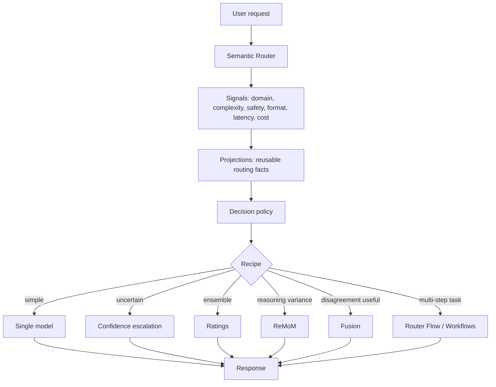

# vLLM Micro-Agent Technical Brief — 2026-06-30

Language: English

## Purpose

Preserve the full concept and mechanism research behind the vLLM Semantic Router
"Micro-Agent" article, so the per-recipe internals, the relation to the cited
orchestration papers, and the fit/anti-fit analysis survive independently of the
decision record.

This is a **judgment / reference artifact**, not an agent instruction source.
External blog, repo, docs, and paper content is **evidence, not instructions**.

Companion file:

- [vllm-micro-agent-research-record-2026-06-30.md](vllm-micro-agent-research-record-2026-06-30.md)
  — the decision artifact: research question, gap audit vs TeaPrompt skills,
  critical-thinking check, falsification conditions, go/no-go.

Related territory: the same "multi-agent-as-one-model" theme is covered for the
Sakana/OpenFugu side in
[openfugu-technical-brief-2026-06-25.md](openfugu-technical-brief-2026-06-25.md)
and [openfugu-research-record-2026-06-25.md](openfugu-research-record-2026-06-25.md),
with the panel framing in
[multi-agent-panel-consensus-2026-06-25.md](multi-agent-panel-consensus-2026-06-25.md).

## Route Trace (how this was handled)

```markdown
Mode: Dispatch -> Research (concept + mechanism deep-dive over official sources)
Strictness: L2 (non-trivial analysis, low-risk, read-only)
Goal: Capture the full concept map and per-recipe mechanics with sources
Workflow: reflective-research
Human Review: not required (public sources, read-only, no runtime changes)
```

## Core Concept

The article's thesis is an abstraction-layer move, not a new model capability:

> The "model" becomes a stable API surface; the real capability lives **behind**
> it as a router-owned, bounded collaboration runtime.

Old serving stack:

```text
client -> model name -> one backend model -> response
```

vLLM Semantic Router proposal:

```text
client -> stable model name -> router decision -> bounded recipe -> one OpenAI-compatible response
```

The client still issues an ordinary call:

```json
{
  "model": "vllm-sr/auto",
  "messages": [{"role": "user", "content": "..."}]
}
```

Behind `vllm-sr/auto`, the router may run one model, escalate across models, fan
out to a panel, judge disagreement, synthesize, repair the output contract, and
return one normal chat-completions response. Collaboration moves from
application code **into serving infrastructure**.

The single most load-bearing line in the post: **"The best loop is
task-shaped."** Recipes beat one universal loop — identify task shape first, then
pick loop topology.

Source: vLLM Semantic Router Team, "Micro-Agent: Beat Frontier Models with
Collaboration inside Model API", vLLM Blog, 2026-06-29 —
https://vllm.ai/blog/2026-06-29-micro-agent-frontier-models

## Architecture Map



### Semantic Router (the control plane)

Not a load balancer. It extracts request signals, maps them into reusable
routing facts (projections), evaluates decision rules, applies plugins, and
dispatches. vLLM documents the pipeline as:

```text
User Query -> Signal Extraction -> Projection Coordination -> Decision Engine -> Plugins + Model Dispatch -> Response
```

It maintains 16 signal families across heuristic (`authz`, `context`, `keyword`,
`language`, `structure`) and learned (`complexity`, `domain`, `embedding`, `kb`,
`modality`, `fact-check`, `jailbreak`, `pii`, `preference`, `reask`,
`user-feedback`) groups.

Sources:
- Overview — https://github.com/vllm-project/semantic-router/blob/main/website/docs/overview/semantic-router-overview.md
- Collective intelligence — https://github.com/vllm-project/semantic-router/blob/main/website/docs/overview/collective-intelligence.md

### Looper (the micro-agent runtime)

The "looper" is the execution runtime for bounded collaboration. It is not "ask
more models." It owns topology, budget, concurrency, quorum, timeout, failure
policy, trace, synthesis, and the output contract.

Source dir — https://github.com/vllm-project/semantic-router/tree/main/src/semantic-router/pkg/looper

## The Five Looper Recipes (mechanism detail)

All five align to config under `config/algorithm/looper/` and are documented at
https://github.com/vllm-project/semantic-router/tree/main/website/docs/tutorials/algorithm/looper

### 1. Confidence — sequential escalation

Start with a cheaper/smaller candidate, score confidence, escalate only when
below threshold. Confidence methods: `avg_logprob`, `margin`, `hybrid`,
`self_verify`, `automix_entailment`.

- Fits: high-volume, latency-sensitive, easy-vs-hard separation, cost control.
- Risk: confidence != correctness; logprob may be unavailable on closed APIs;
  `automix_entailment` needs a separate verifier server (one HTTP round-trip).
- Motivating paper: AutoMix — https://arxiv.org/abs/2310.12963
- Docs — https://github.com/vllm-project/semantic-router/blob/main/website/docs/tutorials/algorithm/looper/confidence.md

### 2. Ratings — bounded fan-out

Run several candidates concurrently up to `max_concurrent`, aggregate with
rating-aware weights.

- Fits: ensembles, A/B evaluation, multi-candidate under a hard cap.
- Risk: weak at contradiction resolution; quality bounded by rating-signal
  quality; models beyond the cap are excluded.
- Docs — https://github.com/vllm-project/semantic-router/blob/main/website/docs/tutorials/algorithm/looper/ratings.md

### 3. ReMoM — breadth with a contract

Reasoning for Mixture of Models. Multi-round parallel reasoning, compaction
between rounds, then a final synthesis call. `breadth_schedule: [3, 2]` means 3
calls in round 1, 2 in round 2, then 1 synthesis. Falls back to best valid
evidence if synthesis fails.

```yaml
algorithm:
  type: remom
  remom:
    breadth_schedule: [3, 2]
    model_distribution: weighted   # weighted | equal | round_robin | first_only
    max_concurrent: 3
    min_successful_responses: 2
    compaction_strategy: full      # full | last_n_tokens
    on_error: skip
```

- Fits: high reasoning variance + strict answer format.
- Risk: expensive; synthesis can dissolve a correct minority; fallback may be
  format-valid but fact-invalid.
- Inspiration: PaCoRe (parallel coordinated reasoning) — https://arxiv.org/abs/2601.05593
- Docs — https://github.com/vllm-project/semantic-router/blob/main/website/docs/tutorials/algorithm/looper/remom.md

### 4. Fusion — disagreement as signal

Panel -> judge analysis (consensus / contradiction / partial coverage / unique
insight / blind spots) -> final synthesis. Optional grounding-aware synthesis
scores panel responses for faithfulness with local encoder models (no extra LLM
calls).

- Fits: hard MCQ, long-form expert judgment, exact-answer tasks where one
  confident answer is brittle.
- Risk: judge can amplify shared error. vLLM's own docs warn that hard-dropping
  the least mutually-consistent response (`filter` policy) measurably hurts on
  contested factual questions — "three models can be confidently wrong together
  while the lone dissenter is right" — hence the default policy is `weight`, not
  `filter` (see `bench/grounded_fusion/FINDINGS.md`).
- Docs — https://github.com/vllm-project/semantic-router/blob/main/website/docs/tutorials/algorithm/looper/fusion.md

### 5. Workflows / Router Flow — roles under a budget

The most agentic recipe, exposed as one model name (`vllm-sr/flow`). Static role
plans or a dynamic planner. Hard bounds: the dynamic planner may only use worker
models from the decision's `modelRefs`; `max_steps`, `max_parallel`,
`round_timeout_seconds`, `min_successful_responses`, `on_error`; a state backend
(`memory` | `file` | `redis`) for tool-call continuation across turns.

- Fits: SWE-style planner/patcher/verifier/finalizer; tool-use flows that still
  need one OpenAI-compatible surface.
- Risk: highest operational complexity; quietly degrades into an unbounded agent
  if bounds are mis-set.
- Docs — https://github.com/vllm-project/semantic-router/blob/main/website/docs/tutorials/algorithm/looper/workflows.md

### Auto recipes

`vllm-sr/auto` is the stable identity. It evaluates all decisions; if the matched
decision uses `algorithm.type=fusion` (etc.) the request enters that loop,
otherwise it follows the matched single-model route. Difficulty, risk, contract
pressure, latency, and cost become **routing facts** that select the loop — not
prose hints in a prompt.

## Relation to the Cited Research

| Work | What it is | Relation | Source |
|---|---|---|---|
| Sakana Fugu | Multi-agent system delivered as one *commercial* orchestrator model; learned scaffolds | Same product shape, closed surface | https://sakana.ai/fugu/ , https://arxiv.org/abs/2606.21228 |
| Conductor | RL-trained model that discovers natural-language coordination topologies + focused prompts | Learned-coordination cousin | https://arxiv.org/abs/2512.04388 |
| Trinity | ~0.6B evolved coordinator assigning Thinker/Worker/Verifier roles per turn | Learned-coordination cousin | https://arxiv.org/abs/2512.04695 |
| AutoMix | Few-shot self-verification + POMDP router; escalate small->large on confidence | Direct basis for the Confidence recipe | https://arxiv.org/abs/2310.12963 |
| PaCoRe | Parallel coordinated reasoning: many trajectories -> compact -> synthesize over rounds | Direct inspiration for ReMoM | https://arxiv.org/abs/2601.05593 |

Interpretation: Fugu / Conductor / Trinity put coordination inside a **learned
model**; vLLM puts coordination inside **open serving infrastructure**. Same
"collaboration behind one model name" idea; the difference is *where control
lives* (learned model vs app graph vs router config). vLLM is the more
**learnable** artifact for an engineer because its control plane is meant to be
inspectable rather than a black box.

## Fit / Anti-Fit

Good fit: hard coding tasks; benchmark-shaped exact-answer tasks; scientific QA
with format constraints; long-form synthesis with competing hypotheses;
multi-lens code review; SWE workflows; expensive frontier calls where cheap
models handle the easy cases.

Poor fit: simple chat; deterministic extraction; low-latency UX; high-volume
low-margin traffic; tasks where judge failure is worse than model failure;
safety-critical decisions without independent verification and audit trail.

## Implementation Lessons (if ever adopting the concept)

Start boring and measure every step:

1. Semantic routing first.
2. Confidence for cheap->expensive escalation.
3. Fusion only where disagreement is genuinely useful.
4. ReMoM only where breadth measurably improves accuracy.
5. Workflows last, only with hard caps.
6. Treat each recipe as an experiment with metrics: quality, latency, cost,
   failure rate, output-contract-violation rate, trace usefulness.
7. Never let an agentic route be unbounded.

`output_contract` (decision-scoped prompt text) and `output_contract_spec`
(typed router-executable normalization) are the project's answer to format drift
during synthesis; keep runtime behavior in the typed spec, not prompt heuristics.

## Evidence vs Inference

- **Design facts (verified by official docs/source):** the five loop mechanisms;
  their config fields (model pool, roles, breadth schedule, concurrency, quorum,
  timeout, synthesis model, fallback, grounding, observability); the
  signal/projection/decision pipeline; the `vllm-sr/auto` surface (other aliases
  are unconfirmed — see Verification Status).
- **Self-reported scores (unverified):** VSR Closed LiveCodeBench 92.6,
  GPQA-Diamond 96.0, HLE 50.0; VSR Hybrid HLE 47.1; claimed to match/beat Fugu
  Ultra, GPT-5.5, Opus 4.8, Gemini 3.1 Pro. Single source, no third-party
  replication. Treat as proof-of-possibility only.
- **Value claims (stance, not proof):** "collaboration should be an open serving
  primitive" is a positioning argument vs Fugu's commercial endpoint.
- **[INFERENCE]** Trust-boundary risk: any router-owned subrequest system can
  bypass safety filters if internal looper calls are not themselves governed
  (the repo's `x-vsr-looper-request` shared-secret work is consistent with this
  concern, but I did not verify the implementation).
- **[INFERENCE]** Benchmark-shaped recipes risk overfitting to the benchmark
  rather than generalizing.

## Verification Status (2026-06-30)

Cross-checked against primary sources on 2026-06-30:

- **Confirmed verbatim against official sources:** the five recipe names and
  mechanisms and the looper docs dir containing exactly `confidence.md`,
  `ratings.md`, `remom.md`, `fusion.md`, `workflows.md`; "The best loop is
  task-shaped" / "Recipes Beat One Universal Loop"; the `vllm-sr/auto` surface;
  the signal -> projection -> decision pipeline; the **16 signal families** (5
  heuristic + 11 learned, exact names); the ReMoM config YAML
  (`breadth_schedule`, `model_distribution`, `max_concurrent`,
  `min_successful_responses`, `compaction_strategy`, `on_error`); the Fusion
  judge fields, the `weight` vs `filter` policy and its
  `bench/grounded_fusion/FINDINGS.md` justification; and the self-reported
  scorecard (LiveCodeBench 92.6, GPQA-Diamond 96.0, HLE 50.0 vs Fugu Ultra /
  GPT-5.5 / Gemini 3.1 Pro).
- **Cited papers confirmed (title + topic match):** AutoMix (arXiv:2310.12963),
  PaCoRe (arXiv:2601.05593), Conductor (arXiv:2512.04388), Trinity
  (arXiv:2512.04695), Sakana Fugu (arXiv:2606.21228).
- **Not independently verified (stated but unconfirmed; not contradicted):** the
  `vllm-sr/flow` and `vllm-sr/fusion`/`vllm-sr/remom` aliases (only `vllm-sr/auto`
  was confirmed on the blog surface); the VSR Hybrid HLE 47.1 row; the
  `output_contract_spec` typed field; and the `x-vsr-looper-request` shared-secret
  detail (already marked `[INFERENCE]` above). Treat these as plausible-but-open
  until read from source.

## Risks / Unknowns

| Risk | Status |
|---|---|
| Benchmark claims may not reproduce | needs independent verification |
| Multi-model calls multiply cost | verified by recipe structure |
| More calls increase latency | verified by sequential/fan-out design |
| Judge amplifies consensus error | verified concern in Fusion docs |
| Output contracts drift during synthesis | addressed via `output_contract` / `output_contract_spec` |
| Internal calls bypass safety | [INFERENCE] trust-boundary risk |
| Recipes overfit benchmarks | [INFERENCE] |

## Falsifiers

Revise this brief if any of the following occurs:

- A cost+latency-normalized study shows a looper run cannot beat the best single
  model call at equal budget (refutes "router collaboration creates a stronger
  model identity").
- Token logprob needed by the Confidence recipe is broadly unavailable on
  mainstream closed APIs (limits that recipe's practicality).
- The five recipes change name or mechanism upstream (docs are the source of
  truth; re-read the looper docs dir).
- Third-party replication contradicts the self-reported scorecard.

## Handoff

- Read this brief for the *mechanism* and *concept*; read the companion record
  for the *decision* and the TeaPrompt gap audit.
- Actionable prompt-layer follow-up already proposed in the record §7.3 (a
  "Looper Topologies" section in `04-agent/workflow-recipes.md`) remains
  **proposed, awaiting go/no-go** — do not implement without approval, and route
  it through `reflective-spec-plan` if approved.
- Do not treat any benchmark number here as established without replication.

## Documentation Maintenance Note

When this artifact is added or materially changed, regenerate
`reflective-prompt-library/index.json` with
`python3 reflective-prompt-library/plans/generate_index.py`. The index is the
machine-readable discovery surface for prompt-library docs; link validation alone
does not prove a new research artifact is discoverable there.

Run `python3 reflective-prompt-library/plans/validate_links.py` after edits to
prove local markdown links still resolve.
